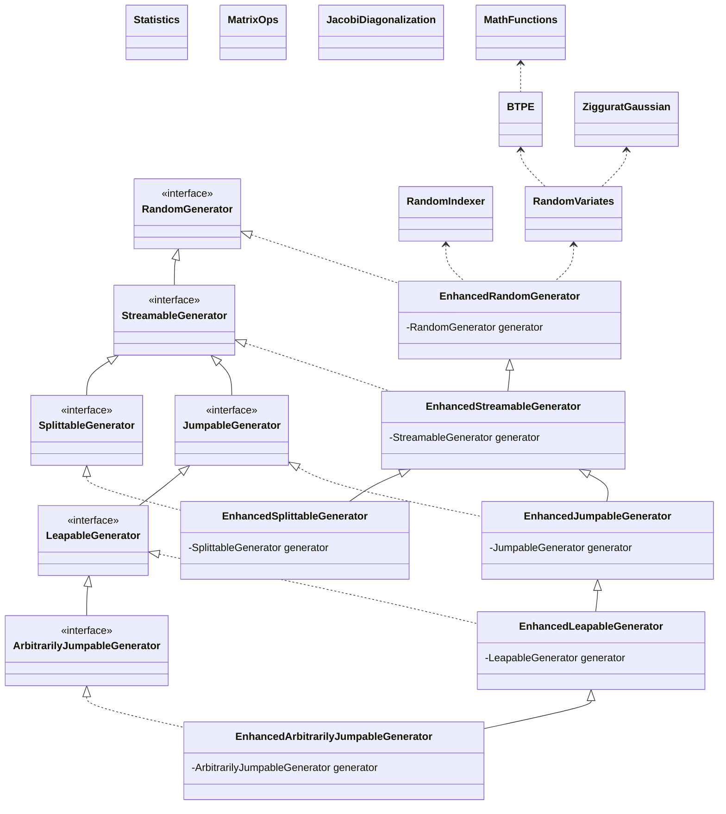

# &rho;&mu; - Java library of Randomization enHancements and Other Math Utilities


Copyright (C) 2017-2022 [Vincent A. Cicirello](https://www.cicirello.org/).

Website: https://rho-mu.cicirello.org/

API documentation: https://rho-mu.cicirello.org/api/

| __Publications About the Library__ | [](https://doi.org/10.21105/joss.04663) |
| :--- | :--- |
| __Packages and Releases__ | [](https://search.maven.org/artifact/org.cicirello/rho-mu) [](https://github.com/cicirello/rho-mu/releases) [](https://jitpack.io/#org.cicirello/rho-mu) |
| __Build Status__ | [](https://github.com/cicirello/rho-mu/actions/workflows/build.yml) [](https://rho-mu.cicirello.org/api/) [](https://github.com/cicirello/rho-mu/actions/workflows/codeql-analysis.yml) |
| __JaCoCo Test Coverage__ | [](https://github.com/cicirello/rho-mu/actions/workflows/build.yml) [](https://github.com/cicirello/rho-mu/actions/workflows/build.yml) |
| __Security__ | [](https://snyk.io/vuln/maven%3Aorg.cicirello%3Arho-mu) [](https://snyk.io/test/github/cicirello/rho-mu) |
| __DOI__ | [](https://zenodo.org/badge/latestdoi/408560166) | 
| __License__ | [](https://github.com/cicirello/rho-mu/blob/main/LICENSE) | 
| __Support__ | [](https://github.com/sponsors/cicirello) [](https://liberapay.com/cicirello) [](https://ko-fi.com/cicirello) |

## How to Cite

If you use this library in your research, please cite the following paper:

> Cicirello, V. A., (2022). ρμ: A Java library of randomization enhancements and other math utilities. *Journal of Open Source Software*, 7(76), 4663, https://doi.org/10.21105/joss.04663.

## Overview

&rho;&mu; is a Java library of Randomization enHancements and Other Math Utilities
(rho mu). It includes implementations of various algorithms for efficiently 
randomly sampling combinations of indexes into arrays and other sequential
structures. It also includes efficient implementations of random number generation from
distributions other than uniform, such as Gaussian, Cauchy, etc. Additionally, it 
includes implementations of other math functions that are either needed by the randomization 
utilities, or which are needed by some of our other projects.

Much of the core randomization enhancements is in a pair of utility classes: `RandomIndexer` and
`RandomVariates`. Beginning with v2.0.0, the &rho;&mu; library was revised to utilize Java 17's
hierarchy of random number generator interfaces (i.e., `RandomGenerator` and its subinterfaces).
Specifically, &rho;&mu; now provides a class `EnhancedRandomGenerator` that wraps an instance
of `RandomGenerator` while also implementing `RandomGenerator`, enabling adding the enhanced
randomization features to any of Java 17's many random number generators, while also serving
as a drop-in replacement. Additionally, &rho;&mu; provides a hierarchy of such wrapper classes,
corresponding to Java 17's hierarchy of random number generator interfaces.

Some of the randomization enhancements include:
* Faster generation of random int values subject to a bound or bound and origin.
* Faster generation of random int values within an IntStream subject to a bound and origin.
* Faster generation of Gaussian distributed random doubles.
* Additional distributions available beyond what is supported by the Java API's `RandomGenerator` classes, 
  such as Binomial and Cauchy random vaiables.
* Ultrafast, but biased, `nextBiasedInt` methods that sacrifices uniformity for speed by excluding the 
  rejection sampling necessary to ensure uniformity, as well as a `biasedInts` methods for generating streams 
  of such integers.
* Methods for generating random pairs of integers without replacement, and random triples of integers without replacement.
* Methods for generating random samples of k integers without replacement from a range of integers.
* Methods to generate streams of numbers from distributions other than uniform, such as streams of random numbers 
  from binomial distributions, Cauchy distributions, exponential distributions, and Gaussian distributions.

The &rho;&mu; library is a dependency of some of our other projects, 
including [JavaPermutationTools](https://github.com/cicirello/JavaPermutationTools)
and [Chips-n-Salsa](https://github.com/cicirello/Chips-n-Salsa).

### Table of Contents

The rest of this README is organized as follows:
* [UML Class Diagram](#uml-class-diagram): A UML class diagram of the library
* [Java Requirements](#java-requirements): Minimum supported Java version information
* [Versioning Scheme](#versioning-scheme): Explanation of the library's version numbers
* [Building the Library (with Maven)](#building-the-library-with-maven)
* [Examples](#examples): Information on example library usage
* [Java Modules](#java-modules): Information for those whose projects use Java modules
* [Importing from Package Repositories](#importing-from-package-repositories)
  * [Importing the Library from Maven Central](#importing-the-library-from-maven-central)
  * [Importing the Library from GitHub Packages](#importing-the-library-from-gitHub-packages)
  * [Importing the Library from JitPack](#importing-the-library-from-jitpack)
* [Downloading Jar Files](#downloading-jar-files): Information on where you can download pre-compiled jars
* [License](#license): Licensing information
* [Contribute](#contribute): Information for those who wish to contribute

## UML Class Diagram

This class diagram summarizes the classes of &rho;&mu; in relation to Java 17's
hierarchy of `RandomGenerator` interfaces. Note that for brevity in the diagram, methods are 
omitted. Each class and interface in the diagram is a clickable link to the javadoc page 
that documents it either within the [documentation of &rho;&mu;](https://rho-mu.cicirello.org/api/) 
for the classes of the &rho;&mu; library, or within the Java 17 API documentation for Java's `RandomGenerator` interfaces.



## Java Requirements

We currently support Java 17+. Our development process utilizes OpenJDK 17, and all
jar files released via Maven Central, GitHub Packages, and GitHub Releases are built
with a Java 17 target.  See the following table for a mapping between library version
and minimum supported Java version.

| version | Java requirements |
| --- | --- |
| 2.x.y | Java 17+ |
| 1.x.y | Java 11+ |

## Versioning Scheme

&rho;&mu; uses [Semantic Versioning](https://semver.org/) with 
version numbers of the form: MAJOR.MINOR.PATCH, where differences 
in MAJOR correspond to incompatible API changes, differences in MINOR 
correspond to introduction of backwards compatible new functionality, 
and PATCH corresponds to backwards compatible bug fixes. 

## Building the Library (with Maven)

The &rho;&mu; library is built using Maven. The root of the
repository contains a Maven `pom.xml`.  To build the library, 
execute `mvn package` at the root of the repository, which
will compile all classes, run all tests, run javadoc, and generate 
jar files of the library, the sources, and the javadocs. The file names
make this distinction explicit.  All build outputs will then
be found in the directory `target`.

To include generation of a code coverage report during the build,
execute `mvn package -Pcoverage` at the root of the repository to 
enable a Maven profile that executes JaCoCo during the test phase.

## Examples

The [examples](examples) directory contains source code of a few example
programs demonstrating how to use various features of the library. The source
code of the examples is commented with explanations where appropriate.

Some of our other projects make extensive use of this library. You may
consult the source code of [JavaPermutationTools](https://github.com/cicirello/JavaPermutationTools)
and/or [Chips-n-Salsa](https://github.com/cicirello/Chips-n-Salsa) for additional
real code examples. For example Chips-n-Salsa is a library of parallel and adaptive
stochastic local search algorithms, and as such requires extensive use of
random number generation.

## Java Modules

This library provides a Java module, `org.cicirello.rho_mu`. To use in your project,
add the following to your `module-info.java`:

```Java
module your.module.name.here {
	requires org.cicirello.rho_mu;
}
```

## Importing from Package Repositories

Prebuilt artifacts are regularly published to Maven Central, GitHub Packages, and JitPack. In most
cases, you'll want to use Maven Central. JitPack may be useful if you want to build your project against
the latest unreleased version, essentially against the default branch of the repository, or a specific commit.
Releases are published to JitPack and GitHub Packages mainly as a fall-back in the unlikely scenario that
Maven Central is unavailable.

### Importing the Library from Maven Central

Add this to the dependencies section of your pom.xml, replacing 
the version number with the version that you want to use.

```XML
<dependency>
  <groupId>org.cicirello</groupId>
  <artifactId>rho-mu</artifactId>
  <version>2.3.0</version>
</dependency>
```

### Importing the Library from GitHub Packages

If you'd prefer to import from GitHub Packages, rather than Maven Central, 
then: (1) add the dependency as indicated in previous section above, and (2) add 
the following to the repositories section of your pom.xml:

```XML
<repository>
  <id>github</id>
  <name>GitHub cicirello Apache Maven Packages</name>
  <url>https://maven.pkg.github.com/cicirello/rho-mu</url>
</repository>
```

Note that GitHub Packages requires authenticating to GitHub. Thus, it is likely less convenient
than importing from Maven Central. We mainly provide this option as a backup source of artifacts.

### Importing the Library from JitPack

You can also import from JitPack. As above, you need to first add JitPack to
the repositories section of your pom.xml, such as:

```XML
<repository>
  <id>jitpack.io</id>
  <url>https://jitpack.io</url>
</repository>
```

JitPack works a bit differently than Maven Central. Specifically, JitPack builds
artifacts on-demand from the GitHub repository the first time a version is requested. We have
configured our domain on JitPack for the groupId, so you can still specify the dependency 
as (just replace `x.y.z` with the version that you want):

```XML
<dependency>
  <groupId>org.cicirello</groupId>
  <artifactId>rho-mu</artifactId>
  <version>x.y.z</version>
</dependency>
```

We have primarily configured JitPack as a source of SNAPSHOT builds. If you want to build
your project against the latest commit, specify the dependency as:

```XML
<dependency>
  <groupId>org.cicirello</groupId>
  <artifactId>rho-mu</artifactId>
  <version>main-SNAPSHOT</version>
</dependency>
```

You can also build against a specific commit using the commit hash as the version.

## Downloading Jar Files

If you don't use a dependency manager that supports importing from Maven Central,
or if you simply prefer to download manually, prebuilt jars are also attached to 
each [GitHub Release](https://github.com/cicirello/rho-mu/releases).

## License

The &rho;&mu; library is licensed under the [GNU General Public License 3.0](https://www.gnu.org/licenses/gpl-3.0.en.html).

## Contribute

If you would like to contribute to &rho;&mu; in any way, such 
as reporting bugs, suggesting new functionality, or code contributions 
such as bug fixes or implementations of new functionality, then start 
by reading the [contribution guidelines](https://github.com/cicirello/.github/blob/main/CONTRIBUTING.md).
This project has adopted 
the [Contributor Covenant Code of Conduct](https://github.com/cicirello/.github/blob/main/CODE_OF_CONDUCT.md).
