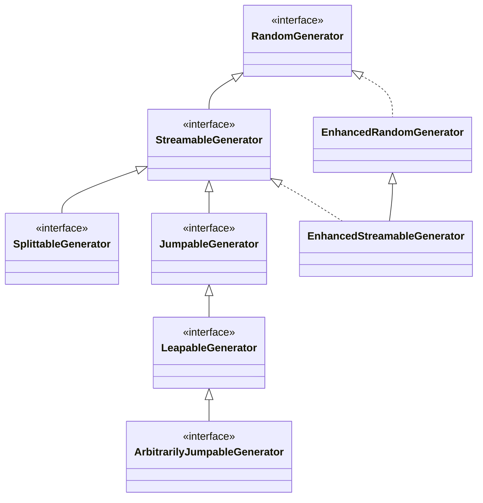

# &rho;&mu; - Java library of Randomization enHancements and Other Math Utilities


Copyright (C) 2017-2022 [Vincent A. Cicirello](https://www.cicirello.org/).

Website: https://rho-mu.cicirello.org/

API documentation: https://rho-mu.cicirello.org/api/

| | |
| :--- | :--- |
| __Artifacts and Releases__ | [](https://search.maven.org/artifact/org.cicirello/rho-mu) [](https://github.com/cicirello/rho-mu/releases) |
| __Build Status__ | [](https://github.com/cicirello/rho-mu/actions/workflows/build.yml) [](https://rho-mu.cicirello.org/api/) [](https://github.com/cicirello/rho-mu/actions/workflows/codeql-analysis.yml) |
| __JaCoCo Test Coverage__ | [](https://github.com/cicirello/rho-mu/actions/workflows/build.yml) [](https://github.com/cicirello/rho-mu/actions/workflows/build.yml) |
| __Security__ | [](https://snyk.io/vuln/maven%3Aorg.cicirello%3Arho-mu) [](https://snyk.io/test/github/cicirello/rho-mu) |
| __DOI__ | [](https://zenodo.org/badge/latestdoi/408560166) | 
| __License__ | [](https://github.com/cicirello/rho-mu/blob/main/LICENSE) | 

## Overview

&rho;&mu; is a Java library of Randomization enHancements and Other Math Utilities
(rho mu). It includes implementations of various algorithms for efficiently 
randomly sampling combinations of indexes into arrays and other sequential
structures. It also includes efficient implementations of random number generation from
distributions other than uniform, such as Gaussian, Cauchy, etc. Additionally, it 
includes implementations of other math functions that are either needed by the randomization 
utilities, or which are needed by some of our other projects.

All of the initial functionality of &rho;&mu; originated in some of our other
libraries, including [JavaPermutationTools](https://github.com/cicirello/JavaPermutationTools)
and [Chips-n-Salsa](https://github.com/cicirello/Chips-n-Salsa). However, we found ourselves 
beginning to add one or the other of those libraries as dependencies in some other projects
strictly for the randomization utilities, which is certainly less than ideal. Therefore, we 
have extracted &rho;&mu; from those libraries.

## Class Hierarchy

This class diagram summarizes the primary classes of &rho;&mu; in relation to Java 17's
hierarchy of RandomGenerator interfaces.



## Java 17+

We currently support Java 17+. Our development process utilizes OpenJDK 17, and all
jar files released via Maven Central, GitHub Packages, and GitHub Releases are built
with a Java 17 target. 

Earlier versions (prior to 2.0.0) require Java 11+.

## Versioning Scheme

&rho;&mu; uses [Semantic Versioning](https://semver.org/) with 
version numbers of the form: MAJOR.MINOR.PATCH, where differences 
in MAJOR correspond to incompatible API changes, differences in MINOR 
correspond to introduction of backwards compatible new functionality, 
and PATCH corresponds to backwards compatible bug fixes. 

## Building the Library (with Maven)

The &rho;&mu; library is built using Maven. The root of the
repository contains a Maven `pom.xml`.  To build the library, 
execute `mvn package` at the root of the repository, which
will compile all classes, run all tests, run javadoc, and generate 
jar files of the library, the sources, and the javadocs. The file names
make this distinction explicit.  All build outputs will then
be found in the directory `target`.

To include generation of a code coverage report during the build,
execute `mvn package -Pcoverage` at the root of the repository to 
enable a Maven profile that executes JaCoCo during the test phase.

## Examples

Some of our other projects make extensive use of this library. You may
consult the source code of [JavaPermutationTools](https://github.com/cicirello/JavaPermutationTools)
and/or [Chips-n-Salsa](https://github.com/cicirello/Chips-n-Salsa) for code
examples. For example Chips-n-Salsa is a library of parallel and adaptive
stochastic local search algorithms, and as such requires extensive use of
random number generation.

## Java Modules

This library provides a Java module, `org.cicirello.rho_mu`. To use in your project,
add the following to your `module-info.java`:

```Java
module your.module.name.here {
	requires org.cicirello.rho_mu;
}
```

## Importing the Library from Maven Central

Add this to the dependencies section of your pom.xml, replacing 
the version number with the version that you want to use.

```XML
<dependency>
  <groupId>org.cicirello</groupId>
  <artifactId>rho-mu</artifactId>
  <version>2.0.0</version>
</dependency>
```

## Importing the Library from GitHub Packages

If you'd prefer to import from GitHub Packages, rather than Maven Central, 
then: (1) add the dependency as indicated in previous section above, and (2) add 
the following to the repositories section of your pom.xml:

```XML
<repository>
  <id>github</id>
  <name>GitHub cicirello Apache Maven Packages</name>
  <url>https://maven.pkg.github.com/cicirello/rho-mu</url>
  <releases><enabled>true</enabled></releases>
  <snapshots><enabled>true</enabled></snapshots>
</repository>
```

## Downloading Jar Files

If you don't use a dependency manager that supports importing from Maven Central,
or if you simply prefer to download manually, prebuilt jars are also attached to 
each [GitHub Release](https://github.com/cicirello/rho-mu/releases).

## License

The &rho;&mu; library is licensed under the [GNU General Public License 3.0](https://www.gnu.org/licenses/gpl-3.0.en.html).

## Contribute

If you would like to contribute to &rho;&mu; in any way, such 
as reporting bugs, suggesting new functionality, or code contributions 
such as bug fixes or implementations of new functionality, then start 
by reading the [contribution guidelines](https://github.com/cicirello/.github/blob/main/CONTRIBUTING.md).
This project has adopted 
the [Contributor Covenant Code of Conduct](https://github.com/cicirello/.github/blob/main/CODE_OF_CONDUCT.md).

